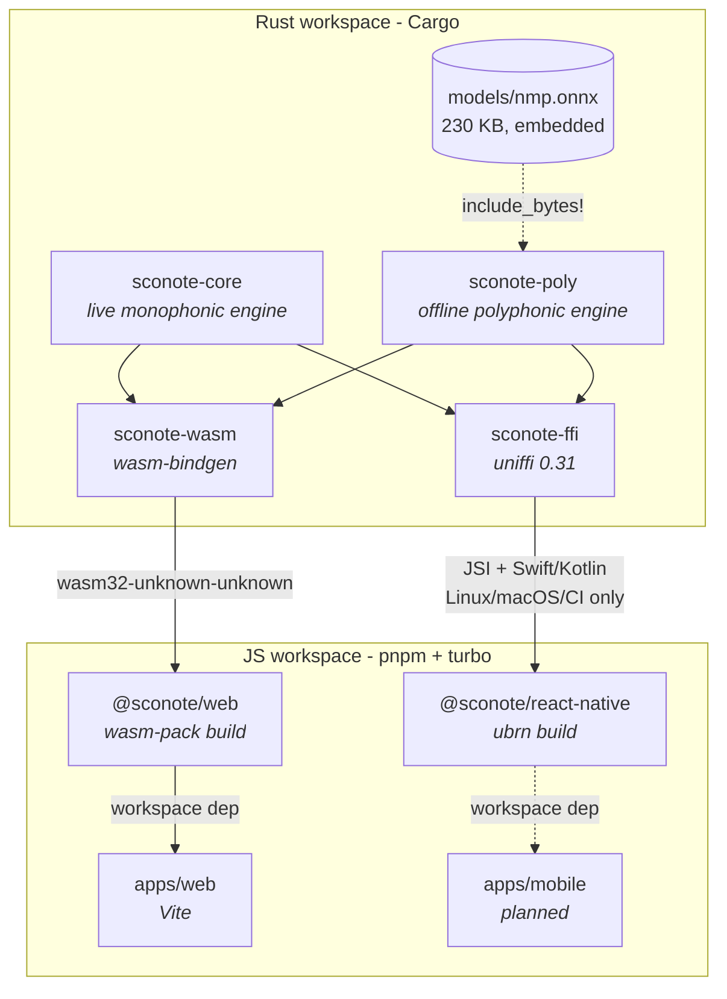
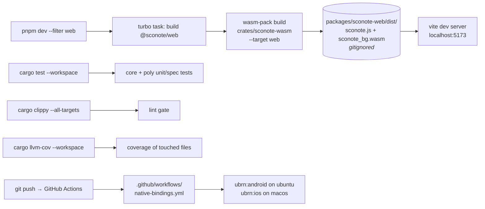
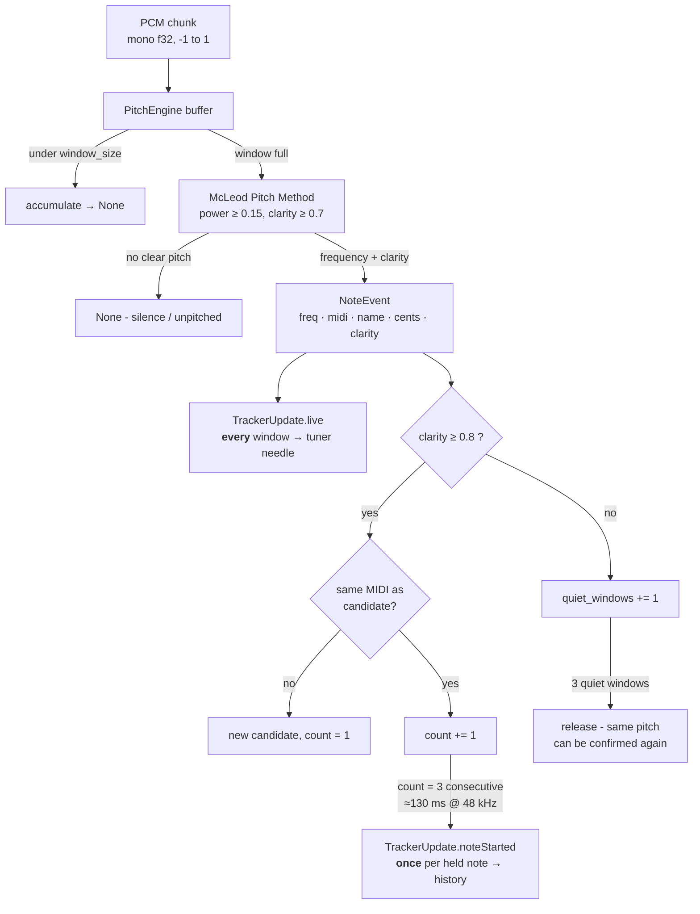
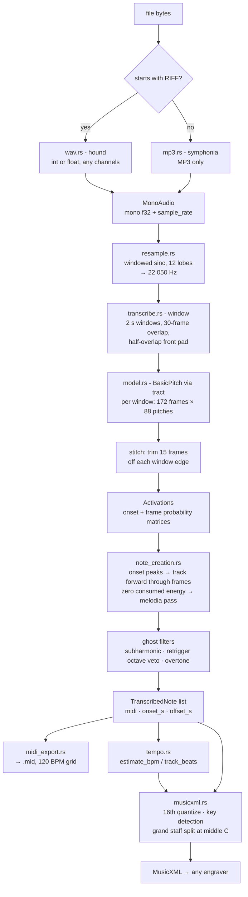
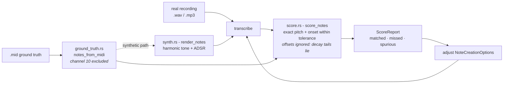
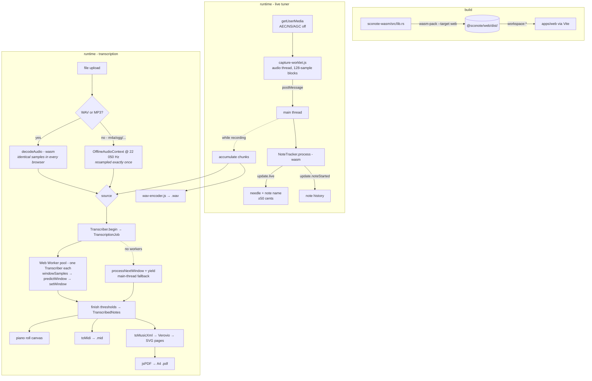
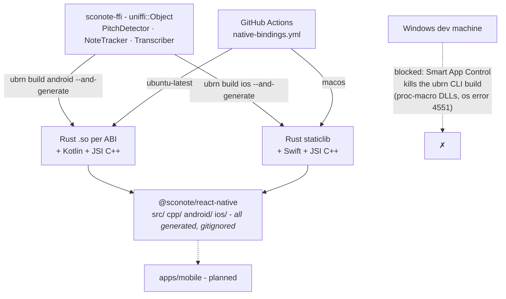
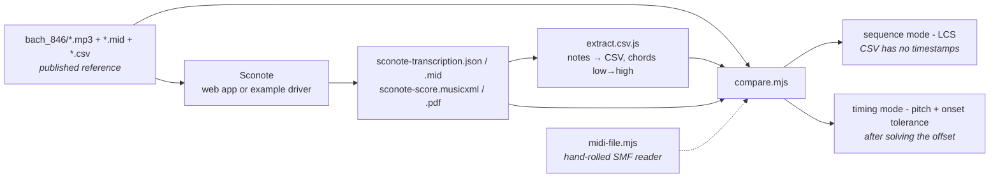

# Sconote

Turn playing into notes. Sconote is a Rust DSP core that does two things:

- **Live tuner** - monophonic pitch detection (McLeod Pitch Method): mic in, note
  name + cents offset out, per analysis window.
- **Offline transcription** - polyphonic note transcription (Spotify's Basic
  Pitch CNN, run in pure Rust via `tract`): a recording in, notes out - and from
  those, MIDI, MusicXML and engraved sheet music.

One core, two thin binding crates (WASM for the web, UniFFI for iOS/Android),
and the apps on top. All DSP and inference is on-device; nothing is uploaded.

**Demo:** <https://soroush-tech.github.io/sconote/> - the web app, running
entirely in your browser.

**Stack:** Rust workspace (edition 2024, stable MSVC) + pnpm/turborepo monorepo
(Node 26).

---

## Repository map

| Path | What it is |
| --- | --- |
| `crates/sconote-core` | Monophonic pitch engine + note tracker. No I/O, no audio capture. |
| `crates/sconote-poly` | Polyphonic transcription: decode → resample → CNN → notes → MIDI/MusicXML, plus the scoring harness it's tuned with. |
| `crates/sconote-wasm` | `wasm-bindgen` wrapper over both engines. |
| `crates/sconote-ffi` | UniFFI wrapper over both engines (Swift/Kotlin). |
| `packages/sconote-web` | `@sconote/web` - the `wasm-pack` build of `sconote-wasm`. |
| `packages/sconote-react-native` | `@sconote/react-native` - turbo-module scaffold; native sources are generated. |
| `apps/web` | Vite tuner + transcriber app. |
| `apps/mobile` | Planned, not yet scaffolded. |
| `examples/` | Reference material and Node scripts for accuracy comparison. |

### How the pieces depend on each other



The two binding crates are deliberately logic-free - **any API change must be
mirrored in both.** 0% test coverage there is accepted; the core must stay
covered.

---

## Root folder - build & test workflow

`turbo` drives the JS side; the `@sconote/web` build task declares the Rust
sources as inputs, so touching a `.rs` file correctly invalidates the wasm cache.



```bash
cargo test --workspace          # all Rust tests
cargo clippy --workspace --all-targets
cargo fmt
cargo build -p sconote-wasm --target wasm32-unknown-unknown   # WASM-cleanliness check
cargo llvm-cov --workspace      # coverage

pnpm install                    # JS deps (pulls the wasm-pack binary)
pnpm build                      # turbo: wasm-pack → vite
pnpm dev --filter web           # tuner app, rebuilds wasm first (~25 s)
```

Release profile is size-tuned (`opt-level = "s"`, LTO, `panic = "abort"`) because
the same artifact ships to WASM and to mobile.

---

## `crates/sconote-core` - live monophonic engine

Platform-agnostic: **there is no audio capture in the SDK.** Callers feed mono
f32 samples in `[-1, 1]`; `PitchEngine` accumulates arbitrary-size chunks (Web
Audio delivers 128 at a time) into 2048-sample analysis windows.

`NoteTracker` wraps the engine and answers two different questions from one
stream - what to *show* right now, and what to *record* as a played note.



The gate is stricter than the engine's own threshold on purpose: a borderline
window still moves the tuner needle but never enters the note history.

`McLeodDetector` is `!Send` only because of internal `Rc<RefCell>` scratch
buffers that never escape it - hence the documented `unsafe impl Send` in
`lib.rs`. Don't remove it without reading the SAFETY comment.

**Files:** `lib.rs` (`PitchEngine`, `NoteEvent`) · `note.rs` (frequency ⇄ note
math) · `tracker.rs` (`NoteTracker`) · `tracker_test.rs` / `tracker_spec.rs` ·
`test_signals.rs`.

---

## `crates/sconote-poly` - offline polyphonic transcription

The heavy crate. Raw audio bytes in, sheet music out. The vendored
`models/nmp.onnx` is Spotify's Basic Pitch "nmp" network (Apache-2.0) - its
graph *includes* the CQT + harmonic-stacking frontend as Conv ops, so the input
is raw 22.05 kHz audio, not a spectrogram.



`Activations` are computed once and cheap to re-extract notes from under
different thresholds - which is what makes threshold tuning practical.

### Two entry points, same pipeline

| API | Use |
| --- | --- |
| `transcribe(&audio, &model, &options)` | Blocking, whole recording. Native / background thread. With the `parallel` feature (on in `sconote-ffi`) the windows run across all cores via rayon. |
| `WindowedTranscription::new` → `process_next_window` → `finish` | Cooperative. The browser drives one window per tick, yielding to the event loop so the page stays alive. |
| `WindowedTranscription::new` → `window_samples` / `predict_window` / `set_window` → `finish` | Distributed. Windows are independent: the web app hands them to a pool of Web Workers (each with its own `Transcriber`) and stores the results in any order. |

Windows are independent, so all three produce identical activations; only
the order of appending matters, and `finish` stitches by window index.

### Tuning loop

`note_creation.rs` deviates from the reference implementation in five documented
places, all aimed at spurious notes on real recordings. Those deviations are
justified by a measurement harness that also lives in this crate:



### Example drivers

```bash
cargo run --release -p sconote-poly --example tune     -- <session.wav|mp3> <ref.mid>...
cargo run --release -p sconote-poly --example ablate   -- <render.wav> <ref.mid>
cargo run --release -p sconote-poly --example to_midi  -- <in.wav|mp3> <out.mid>
cargo run --release -p sconote-poly --example peek     -- <wav> <from_s> <to_s>
cargo run --release -p sconote-poly --example xml_dump -- <notes.mid> <out.musicxml>
```

- **`tune`** - grid-searches thresholds against ground truth, auto-solving the
  unknown time offset between a recording and the reference.
- **`ablate`** - which note-creation stage invents the extra notes? Re-extracts
  from one cached activation matrix under each combination of heuristics.
- **`xml_dump`** - the same MusicXML the apps ship, inspectable without a browser.

Feature choices are WASM-driven: `midly` without `parallel` (rayon panics on
wasm32), `symphonia` with MP3 only, and the crate's own `parallel` feature
(rayon over transcription windows) is off by default - only `sconote-ffi`
enables it. **This crate must stay WASM-clean.**

---

## `crates/sconote-wasm` → `packages/sconote-web` → `apps/web`



Engraving is delegated to Verovio: the Rust core makes the *notation* decisions
(quantization, key signature, staff split) and emits MusicXML; Verovio only
typesets it.

Two `vite.config.js` settings are load-bearing:

- `assetsInlineLimit: 0` - `audioWorklet.addModule` rejects `data:` URLs in some
  browsers, so the worklet must stay a real file.
- `optimizeDeps.exclude: ["@sconote/web", "verovio"]` - pre-bundling breaks the
  glue code's `new URL("..._bg.wasm", import.meta.url)` resolution.

WASM objects are manually freed (`.free()`) after each update - there's no GC
across the boundary.

---

## `crates/sconote-ffi` → `packages/sconote-react-native`

Same API surface as the WASM binding, expressed as UniFFI records and objects.
UniFFI objects must be `Send + Sync`, so the engines sit behind a `Mutex`.



Everything under that package's `src/`, `cpp/`, `android/`, `ios/` and the
podspec is **generated and gitignored**. Generation runs on Linux/macOS or CI
only. The `uniffi` crate version must stay in lockstep with
`uniffi-bindgen-react-native` (both 0.31).

---

## `examples/` - accuracy reference material

A scratch directory (no `package.json`, plain Node scripts) holding a worked
end-to-end case: Bach BWV 846 as published MP3 + MIDI + PDF, alongside what
Sconote produced from it.



```bash
node examples/compare.mjs examples/bach_846/...csv  .../sconote-transcription.json   # sequence
node examples/compare.mjs examples/bach_846/...mid  .../sconote-transcription.mid    # timing
```

---

## Conventions

- Tests are co-located: `foo.rs` + `foo_test.rs` (unit) + `foo_spec.rs`
  (behavioural). See `.claude/skills/project-structure`.
- After any implementation: add tests, run `cargo test`, check
  `cargo llvm-cov` on touched files. Coverage gaps should be deliberate.
- API changes must land in **both** `sconote-wasm` and `sconote-ffi`.
- Crate names use `sconote`; the checkout directory is `scornOn` (not a valid
  crate name).

### Environment quirks (Windows)

- **Smart App Control** sometimes blocks freshly compiled build scripts
  (`os error 4551`) on first run. For workspace `cargo` commands it's transient -
  re-run. For the `uniffi-bindgen-react-native` CLI it's permanent; bindings
  generation only works on Linux/macOS/CI.
- iOS builds require a Mac.

## Licence & attribution

The bundled `crates/sconote-poly/models/nmp.onnx` is Spotify's
[Basic Pitch](https://github.com/spotify/basic-pitch) `icassp_2022/nmp.onnx`
model, Apache-2.0. `note_creation.rs` is a port of that project's
`output_to_notes_polyphonic`, with five documented deviations.
